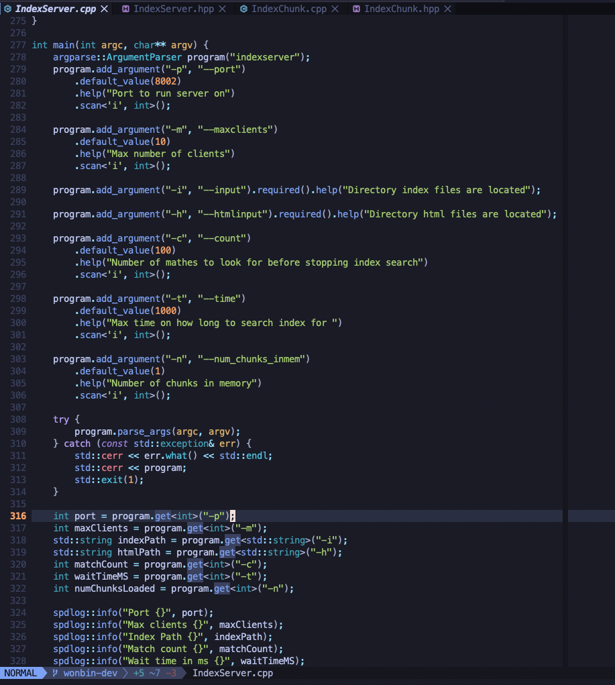

## Check it out [here](https://github.com/wbjin/nvim)

## Why Neovim
Some of you may wonder why I use neovim as my IDE instead of more modern tools like VSCode. I'm a
big fan of VSCode and I think it's a great IDE but neovim provides customizability fall greater than
any IDE out there. With neovim, I rarely have to take my hands off of the keyboard and I can write
code much faster than I was every able to. I started out by using vim bindings on VSCode and
eventually made the jump to neovim once I go comfortable. I encourage others to do the same if
they're curious about how to improve their workflow.

## My Config
My config is heavily inspired by TJ Devries'
[Kickstart.nvim](https://github.com/nvim-lua/kickstart.nvim). Some plugins that it supports are
- LSPConfig
- Treesitter
- Telescope
- Harpoon
- Cmp
- Lualine
- Nvimtree
- Autosave
- Hop

It looks a little like this:

